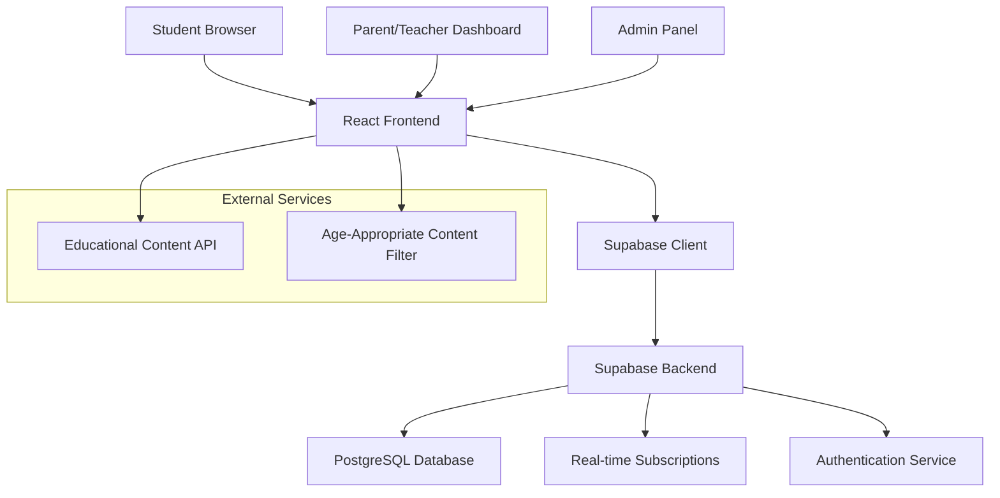
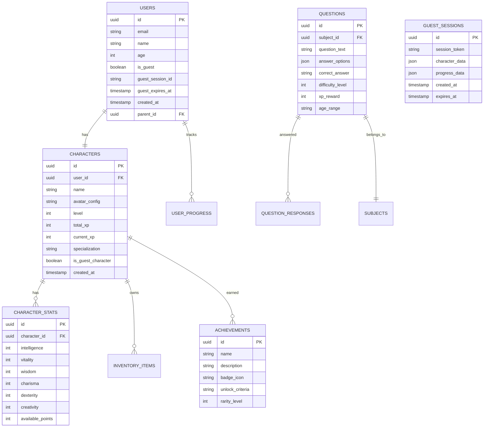

# Educational RPG Tutor - Design Document

## Overview

The Educational RPG Tutor is a web-based gamified learning platform that transforms traditional education into an engaging RPG experience. Students create customizable characters that level up through learning activities, earning experience points, stats, achievements, and collectible items. The platform serves ages 3-18 with adaptive content and comprehensive progress tracking.

**Core Technology Stack:**
- **Frontend:** React with TypeScript for type safety and component reusability
- **Backend:** Supabase for authentication, real-time database, and API
- **Styling:** Tailwind CSS for responsive, game-like UI components
- **State Management:** React Context + useReducer for character state
- **Animations:** Framer Motion for smooth RPG-style transitions and celebrations

## Architecture

### High-Level System Architecture



### Database Schema Design



## Components and Interfaces

### Frontend Component Architecture

```
src/
├── components/
│   ├── character/
│   │   ├── CharacterAvatar.tsx
│   │   ├── CharacterStats.tsx
│   │   ├── CharacterCustomization.tsx
│   │   └── LevelUpModal.tsx
│   ├── learning/
│   │   ├── QuestionCard.tsx
│   │   ├── MultipleChoice.tsx
│   │   ├── LessonProgress.tsx
│   │   └── SubjectWorlds.tsx
│   ├── gamification/
│   │   ├── XPBar.tsx
│   │   ├── AchievementBadge.tsx
│   │   ├── Leaderboard.tsx
│   │   ├── QuestTracker.tsx
│   │   └── InventoryGrid.tsx
│   ├── home/
│   │   ├── RPGHomePage.tsx
│   │   ├── DashboardStats.tsx
│   │   └── QuickActions.tsx
│   └── shared/
│       ├── AnimatedButton.tsx
│       ├── ProgressBar.tsx
│       └── NotificationToast.tsx
├── hooks/
│   ├── useCharacter.ts
│   ├── useXPSystem.ts
│   ├── useAchievements.ts
│   └── useSupabase.ts
├── services/
│   ├── supabaseClient.ts
│   ├── characterService.ts
│   ├── questionService.ts
│   └── progressService.ts
└── types/
    ├── character.ts
    ├── question.ts
    └── achievement.ts
```

### Core Interfaces

```typescript
interface User {
  id: string;
  email?: string;
  name: string;
  age?: number;
  isGuest: boolean;
  guestSessionId?: string;
  guestExpiresAt?: Date;
  parentId?: string;
}

interface Character {
  id: string;
  userId: string;
  name: string;
  level: number;
  totalXP: number;
  currentXP: number;
  avatarConfig: AvatarConfig;
  stats: CharacterStats;
  specialization?: Specialization;
  equippedItems: EquippedItem[];
  isGuestCharacter: boolean;
}

interface CharacterStats {
  intelligence: number;
  vitality: number;
  wisdom: number;
  charisma: number;
  dexterity: number;
  creativity: number;
  availablePoints: number;
}

interface GuestSession {
  id: string;
  sessionToken: string;
  characterData: Character;
  progressData: UserProgress;
  createdAt: Date;
  expiresAt: Date;
}

interface Question {
  id: string;
  subjectId: string;
  questionText: string;
  answerOptions: string[];
  correctAnswer: string;
  difficultyLevel: number;
  xpReward: number;
  ageRange: string;
}

interface Achievement {
  id: string;
  name: string;
  description: string;
  badgeIcon: string;
  unlockCriteria: string;
  rarityLevel: number;
  unlockedAt?: Date;
}
```

## Data Models

### Character Progression System

**XP Calculation Formula:**
```typescript
const calculateXPReward = (
  baseDifficulty: number,
  accuracy: number,
  timeBonus: number,
  statMultiplier: number
): number => {
  const baseXP = baseDifficulty * 10;
  const accuracyBonus = accuracy * 0.5;
  const timeBonusXP = timeBonus * 0.3;
  const statBonus = statMultiplier * 0.2;
  
  return Math.floor(baseXP + accuracyBonus + timeBonusXP + statBonus);
};
```

**Level Progression:**
- Level 1-10: 100 XP per level (linear)
- Level 11-25: 150 XP per level 
- Level 26+: 200 XP per level
- Each level awards 3 stat points to distribute

### Subject-to-Stat Mapping

```typescript
const SUBJECT_STAT_MAPPING = {
  mathematics: { primary: 'intelligence', secondary: 'wisdom' },
  biology: { primary: 'vitality', secondary: 'intelligence' },
  history: { primary: 'wisdom', secondary: 'charisma' },
  language_arts: { primary: 'charisma', secondary: 'creativity' },
  science: { primary: 'dexterity', secondary: 'intelligence' },
  art: { primary: 'creativity', secondary: 'charisma' }
};
```

### Guest Account System

**Guest Session Management:**
```typescript
interface GuestService {
  createGuestSession(): Promise<GuestSession>;
  loadGuestProgress(sessionToken: string): GuestSession | null;
  saveGuestProgress(sessionToken: string, data: Partial<GuestSession>): void;
  convertGuestToUser(sessionToken: string, userDetails: UserRegistration): Promise<User>;
  cleanupExpiredSessions(): void;
}
```

**Guest Character Generation:**
```typescript
const generateGuestCharacter = (): Character => {
  const randomNames = ['Alex', 'Jordan', 'Casey', 'Riley', 'Sage', 'Quinn'];
  const randomAvatars = generateRandomAvatarConfig();
  
  return {
    name: randomNames[Math.floor(Math.random() * randomNames.length)],
    level: 1,
    totalXP: 0,
    currentXP: 0,
    avatarConfig: randomAvatars,
    stats: { intelligence: 5, vitality: 5, wisdom: 5, charisma: 5, dexterity: 5, creativity: 5, availablePoints: 0 },
    isGuestCharacter: true
  };
};
```

**Guest Data Storage Strategy:**
- **Session Duration:** 24 hours for active sessions, 7 days maximum
- **Local Storage:** Character progress cached in browser localStorage
- **Server Backup:** Optional server-side session storage for cross-device access
- **Conversion Process:** Seamless transfer of all progress when upgrading to full account

### Achievement System

**Achievement Categories:**
- **Learning Milestones:** Complete X lessons in a subject
- **Accuracy Achievements:** Maintain X% accuracy over Y questions
- **Streak Rewards:** Study for X consecutive days
- **Social Achievements:** Help classmates, participate in challenges
- **Collection Achievements:** Collect rare items, complete sets
- **Stat Achievements:** Reach certain stat thresholds

## Error Handling

### Frontend Error Boundaries

```typescript
class GameErrorBoundary extends React.Component {
  // Handles character loading failures
  // Provides fallback UI for broken game states
  // Logs errors to Supabase for monitoring
}
```

### Supabase Error Handling

**Connection Issues:**
- Implement retry logic with exponential backoff
- Cache character data locally for offline scenarios
- Show user-friendly messages for network issues

**Data Validation:**
- Validate all XP awards before database updates
- Prevent stat manipulation through client-side validation
- Implement server-side validation rules in Supabase

**Authentication Errors:**
- Handle expired sessions gracefully
- Provide clear login prompts for unauthenticated users
- Support parental consent flows for users under 13

## Testing Strategy

### Unit Testing
- **Character Logic:** XP calculations, level progression, stat distribution
- **Question System:** Answer validation, XP rewards, difficulty scaling
- **Achievement Engine:** Unlock conditions, badge awarding logic

### Integration Testing
- **Supabase Integration:** Database operations, real-time updates
- **Authentication Flow:** User registration, parental consent, session management
- **Progress Tracking:** Cross-session data persistence, progress synchronization

### User Experience Testing
- **Age-Appropriate Content:** Verify content filtering for different age groups
- **Accessibility:** Screen reader compatibility, keyboard navigation
- **Performance:** Loading times for character data, smooth animations

### End-to-End Testing
- **Complete Learning Journey:** Registration → Character Creation → Learning → Progression
- **Multi-User Scenarios:** Leaderboards, trading, social features
- **Parent Dashboard:** Progress monitoring, report generation

### Testing Tools
- **Jest + React Testing Library:** Component and hook testing
- **Cypress:** End-to-end user flows
- **Supabase Test Client:** Database operation testing
- **Accessibility Testing:** axe-core integration

## Security Considerations

### Data Protection
- All character data encrypted at rest in Supabase
- COPPA compliance for users under 13
- Parental consent workflows with email verification

### Input Validation
- Sanitize all user inputs (character names, custom content)
- Validate XP awards server-side to prevent cheating
- Rate limiting on question submissions

### Privacy Controls
- Optional profile visibility settings
- Secure trading system with approval workflows
- Parent/teacher oversight controls for social features