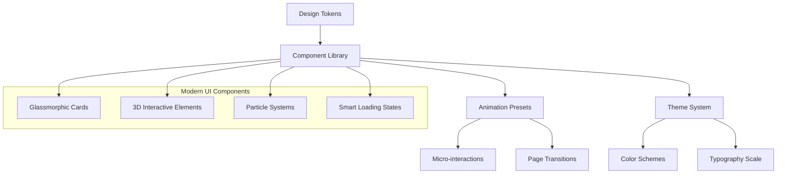
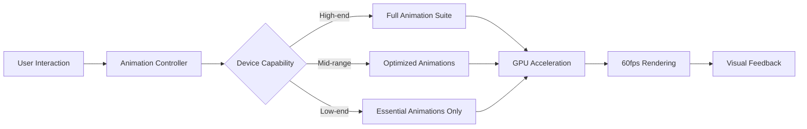

# Modern UI Redesign - Design Document

## Overview

The Modern UI Redesign transforms the Educational RPG Tutor into a cutting-edge application that incorporates 2025's most compelling design trends. This design leverages glassmorphism, advanced particle systems, 3D interactions, and performance-optimized animations to create an immersive educational gaming experience that rivals industry-leading applications.

**Key Design Principles:**
- **Immersive Depth:** Multi-layered visual hierarchy with 3D transforms and parallax effects
- **Fluid Interactions:** 60fps animations with intelligent performance scaling
- **Accessible Innovation:** Modern aesthetics that respect accessibility preferences
- **Contextual Responsiveness:** Adaptive UI that responds to user behavior and device capabilities

**Technology Stack:**
- **Animation Engine:** Framer Motion with React Spring for complex physics-based animations
- **3D Graphics:** Three.js integration for character avatars and particle systems
- **Styling:** Tailwind CSS with custom CSS-in-JS for advanced effects
- **Performance:** React.memo, useMemo, and Web Workers for animation optimization
- **Audio:** Web Audio API for contextual sound design

## Architecture

### Design System Architecture



### Animation Performance Architecture



## Components and Interfaces

### Core Design Components

#### 1. Glassmorphic Design System

**Glass Card Component:**
```typescript
interface GlassCardProps {
  blur?: 'sm' | 'md' | 'lg' | 'xl';
  opacity?: number;
  border?: 'subtle' | 'prominent' | 'glow';
  shadow?: 'soft' | 'medium' | 'dramatic';
  interactive?: boolean;
  children: React.ReactNode;
}

const GlassCard: React.FC<GlassCardProps> = ({
  blur = 'md',
  opacity = 0.1,
  border = 'subtle',
  shadow = 'soft',
  interactive = false,
  children
}) => {
  const blurClasses = {
    sm: 'backdrop-blur-sm',
    md: 'backdrop-blur-md',
    lg: 'backdrop-blur-lg',
    xl: 'backdrop-blur-xl'
  };
  
  return (
    <motion.div
      className={`
        ${blurClasses[blur]} 
        bg-white/[${opacity}] 
        border border-white/20 
        rounded-2xl 
        ${shadow === 'dramatic' ? 'shadow-2xl' : 'shadow-lg'}
        ${interactive ? 'hover:bg-white/[0.15] transition-all duration-300' : ''}
      `}
      whileHover={interactive ? { scale: 1.02, y: -2 } : undefined}
      transition={{ type: "spring", stiffness: 300, damping: 30 }}
    >
      {children}
    </motion.div>
  );
};
```

#### 2. Advanced Particle System

**Interactive Particle Engine:**
```typescript
interface ParticleSystemProps {
  particleCount: number;
  interactionRadius: number;
  theme: 'magical' | 'tech' | 'nature' | 'cosmic';
  responsive: boolean;
}

const ParticleSystem: React.FC<ParticleSystemProps> = ({
  particleCount,
  interactionRadius,
  theme,
  responsive
}) => {
  const [mousePosition, setMousePosition] = useState({ x: 0, y: 0 });
  const [particles, setParticles] = useState<Particle[]>([]);
  
  // Particle physics with magnetic attraction/repulsion
  const updateParticles = useCallback(() => {
    setParticles(prev => prev.map(particle => ({
      ...particle,
      x: particle.x + particle.vx,
      y: particle.y + particle.vy,
      vx: particle.vx * 0.99, // Friction
      vy: particle.vy * 0.99,
      // Magnetic interaction with cursor
      magneticForce: calculateMagneticForce(particle, mousePosition)
    })));
  }, [mousePosition]);
  
  return (
    <div className="absolute inset-0 overflow-hidden pointer-events-none">
      <canvas
        ref={canvasRef}
        className="w-full h-full"
        onMouseMove={handleMouseMove}
      />
    </div>
  );
};
```

#### 3. 3D Interactive Elements

**3D Character Avatar:**
```typescript
interface Avatar3DProps {
  character: Character;
  interactive: boolean;
  lighting: 'ambient' | 'dramatic' | 'soft';
}

const Avatar3D: React.FC<Avatar3DProps> = ({ character, interactive, lighting }) => {
  const meshRef = useRef<THREE.Mesh>();
  const [hovered, setHovered] = useState(false);
  
  useFrame((state) => {
    if (meshRef.current) {
      // Smooth rotation based on mouse position
      meshRef.current.rotation.y = THREE.MathUtils.lerp(
        meshRef.current.rotation.y,
        (state.mouse.x * Math.PI) / 10,
        0.1
      );
      
      // Floating animation
      meshRef.current.position.y = Math.sin(state.clock.elapsedTime) * 0.1;
    }
  });
  
  return (
    <Canvas camera={{ position: [0, 0, 5] }}>
      <ambientLight intensity={0.5} />
      <pointLight position={[10, 10, 10]} />
      <mesh
        ref={meshRef}
        onPointerOver={() => setHovered(true)}
        onPointerOut={() => setHovered(false)}
        scale={hovered ? 1.1 : 1}
      >
        <sphereGeometry args={[1, 32, 32]} />
        <meshStandardMaterial 
          color={character.primaryColor}
          metalness={0.3}
          roughness={0.4}
        />
      </mesh>
    </Canvas>
  );
};
```

#### 4. Smart Loading States

**Skeleton Loading System:**
```typescript
interface SkeletonProps {
  variant: 'text' | 'card' | 'avatar' | 'chart';
  animation: 'pulse' | 'wave' | 'shimmer';
  lines?: number;
}

const Skeleton: React.FC<SkeletonProps> = ({ variant, animation, lines = 3 }) => {
  const getSkeletonClasses = () => {
    const base = 'bg-gradient-to-r from-slate-200 via-slate-300 to-slate-200';
    const animations = {
      pulse: 'animate-pulse',
      wave: 'animate-wave',
      shimmer: 'animate-shimmer'
    };
    
    return `${base} ${animations[animation]} rounded-lg`;
  };
  
  if (variant === 'text') {
    return (
      <div className="space-y-3">
        {Array.from({ length: lines }, (_, i) => (
          <div
            key={i}
            className={`${getSkeletonClasses()} h-4`}
            style={{ width: `${Math.random() * 40 + 60}%` }}
          />
        ))}
      </div>
    );
  }
  
  // Other skeleton variants...
};
```

### Modern Layout Patterns

#### 1. Responsive Grid System

**Masonry Layout for Dynamic Content:**
```css
.masonry-grid {
  display: grid;
  grid-template-columns: repeat(auto-fill, minmax(300px, 1fr));
  grid-auto-rows: masonry; /* Future CSS feature with fallback */
  gap: 1.5rem;
  align-items: start;
}

/* Fallback for browsers without masonry support */
@supports not (grid-auto-rows: masonry) {
  .masonry-grid {
    display: flex;
    flex-wrap: wrap;
    gap: 1.5rem;
  }
  
  .masonry-item {
    flex: 1 1 300px;
    break-inside: avoid;
  }
}
```

#### 2. Fluid Typography Scale

**Variable Font Implementation:**
```css
:root {
  --font-size-xs: clamp(0.75rem, 0.7rem + 0.25vw, 0.875rem);
  --font-size-sm: clamp(0.875rem, 0.8rem + 0.375vw, 1rem);
  --font-size-base: clamp(1rem, 0.9rem + 0.5vw, 1.125rem);
  --font-size-lg: clamp(1.125rem, 1rem + 0.625vw, 1.25rem);
  --font-size-xl: clamp(1.25rem, 1.1rem + 0.75vw, 1.5rem);
  --font-size-2xl: clamp(1.5rem, 1.3rem + 1vw, 2rem);
  --font-size-3xl: clamp(2rem, 1.7rem + 1.5vw, 3rem);
}

.text-fluid {
  font-size: var(--font-size-base);
  font-variation-settings: 'wght' 400, 'slnt' 0;
  transition: font-variation-settings 0.3s ease;
}

.text-fluid:hover {
  font-variation-settings: 'wght' 500, 'slnt' -5;
}
```

## Data Models

### Animation State Management

```typescript
interface AnimationState {
  isAnimating: boolean;
  currentAnimation: string | null;
  queue: AnimationQueueItem[];
  performance: PerformanceMetrics;
}

interface AnimationQueueItem {
  id: string;
  type: 'micro' | 'transition' | 'celebration';
  priority: number;
  duration: number;
  element: string;
}

interface PerformanceMetrics {
  fps: number;
  frameDrops: number;
  memoryUsage: number;
  deviceCapability: 'high' | 'medium' | 'low';
}
```

### Theme System

```typescript
interface ModernTheme {
  id: string;
  name: string;
  colors: {
    primary: ColorScale;
    secondary: ColorScale;
    accent: ColorScale;
    neutral: ColorScale;
    glass: GlassColors;
  };
  effects: {
    blur: BlurSettings;
    shadows: ShadowSettings;
    gradients: GradientPresets;
  };
  animations: AnimationPresets;
}

interface GlassColors {
  background: string;
  border: string;
  highlight: string;
  shadow: string;
}

interface AnimationPresets {
  micro: MotionProps;
  hover: MotionProps;
  focus: MotionProps;
  celebration: MotionProps;
}
```

## Error Handling

### Animation Error Recovery

```typescript
class AnimationErrorBoundary extends React.Component<Props, State> {
  constructor(props: Props) {
    super(props);
    this.state = { hasError: false, fallbackMode: false };
  }
  
  static getDerivedStateFromError(error: Error): State {
    // Activate fallback mode for animation errors
    return { hasError: true, fallbackMode: true };
  }
  
  componentDidCatch(error: Error, errorInfo: ErrorInfo) {
    // Log animation performance issues
    console.error('Animation Error:', error, errorInfo);
    
    // Automatically reduce animation complexity
    this.reduceAnimationComplexity();
  }
  
  reduceAnimationComplexity = () => {
    // Disable non-essential animations
    // Reduce particle count
    // Switch to CSS animations instead of JS
  };
}
```

### Performance Monitoring

```typescript
const usePerformanceMonitor = () => {
  const [metrics, setMetrics] = useState<PerformanceMetrics>();
  
  useEffect(() => {
    const observer = new PerformanceObserver((list) => {
      const entries = list.getEntries();
      entries.forEach((entry) => {
        if (entry.entryType === 'measure') {
          // Track animation performance
          updateAnimationMetrics(entry);
        }
      });
    });
    
    observer.observe({ entryTypes: ['measure', 'navigation'] });
    
    return () => observer.disconnect();
  }, []);
  
  const updateAnimationMetrics = (entry: PerformanceEntry) => {
    // Adjust animation complexity based on performance
    if (entry.duration > 16.67) { // Slower than 60fps
      reduceAnimationComplexity();
    }
  };
};
```

## Testing Strategy

### Visual Regression Testing

```typescript
// Chromatic integration for visual testing
const visualTests = {
  'glassmorphic-cards': {
    component: GlassCard,
    variants: ['default', 'interactive', 'high-blur'],
    viewports: [320, 768, 1024, 1440]
  },
  'particle-systems': {
    component: ParticleSystem,
    variants: ['magical', 'tech', 'cosmic'],
    interactions: ['hover', 'click', 'scroll']
  }
};
```

### Animation Performance Testing

```typescript
describe('Animation Performance', () => {
  test('maintains 60fps during complex animations', async () => {
    const performanceObserver = new PerformanceObserver();
    
    // Trigger complex animation sequence
    await triggerAnimationSequence();
    
    const metrics = await getPerformanceMetrics();
    expect(metrics.averageFPS).toBeGreaterThan(58);
    expect(metrics.frameDrops).toBeLessThan(5);
  });
  
  test('gracefully degrades on low-end devices', async () => {
    // Simulate low-end device
    mockDeviceCapabilities('low');
    
    const animationComplexity = getAnimationComplexity();
    expect(animationComplexity.particleCount).toBeLessThan(25);
    expect(animationComplexity.blurEffects).toBe('reduced');
  });
});
```

### Accessibility Testing

```typescript
describe('Accessibility Compliance', () => {
  test('respects prefers-reduced-motion', () => {
    // Mock reduced motion preference
    mockMediaQuery('(prefers-reduced-motion: reduce)');
    
    render(<AnimatedComponent />);
    
    // Verify animations are disabled or simplified
    expect(getAnimationDuration()).toBeLessThan(200);
  });
  
  test('maintains focus management during animations', async () => {
    render(<ModalWithAnimations />);
    
    // Test focus trap during modal animations
    await openModal();
    expect(getFocusedElement()).toBeInTheDocument();
    
    await closeModal();
    expect(getFocusedElement()).toBe(previouslyFocusedElement);
  });
});
```

## Implementation Phases

### Phase 1: Foundation (Week 1-2)
- Design system setup with Tailwind CSS custom configuration
- Animation library integration (Framer Motion + React Spring)
- Performance monitoring infrastructure
- Basic glassmorphic components

### Phase 2: Core Components (Week 3-4)
- Advanced particle system implementation
- 3D interactive elements with Three.js
- Smart loading states and skeleton screens
- Responsive grid system with masonry layout

### Phase 3: Interactions (Week 5-6)
- Micro-interactions and hover effects
- Page transition animations
- Form interactions with floating labels
- Modal and overlay experiences

### Phase 4: Polish & Optimization (Week 7-8)
- Performance optimization and device adaptation
- Accessibility compliance and testing
- Sound design integration
- Cross-browser compatibility testing

## Performance Considerations

### Animation Optimization Strategies

1. **GPU Acceleration:** Use `transform` and `opacity` properties for animations
2. **Batched Updates:** Group DOM updates using `requestAnimationFrame`
3. **Intersection Observer:** Only animate elements in viewport
4. **Web Workers:** Offload complex calculations for particle systems
5. **Memory Management:** Cleanup animation listeners and Three.js objects

### Device Adaptation Logic

```typescript
const getDeviceCapability = (): DeviceCapability => {
  const canvas = document.createElement('canvas');
  const gl = canvas.getContext('webgl');
  
  if (!gl) return 'low';
  
  const renderer = gl.getParameter(gl.RENDERER);
  const memory = (navigator as any).deviceMemory || 4;
  const cores = navigator.hardwareConcurrency || 2;
  
  if (memory >= 8 && cores >= 8) return 'high';
  if (memory >= 4 && cores >= 4) return 'medium';
  return 'low';
};
```

This design document provides a comprehensive blueprint for creating a modern, engaging UI that incorporates the latest design trends while maintaining excellent performance and accessibility standards.