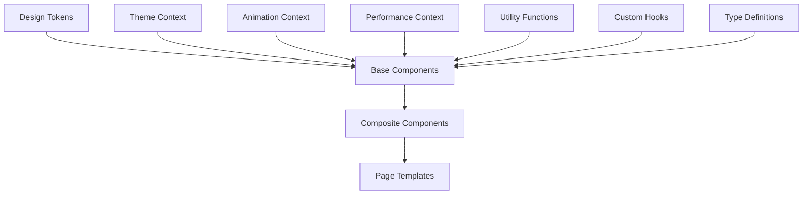

# Developer Guide - Modern UI Design System
## Educational RPG Tutor

### Table of Contents
1. [Getting Started](#getting-started)
2. [Architecture Overview](#architecture-overview)
3. [Component Development](#component-development)
4. [Performance Guidelines](#performance-guidelines)
5. [Testing Standards](#testing-standards)
6. [Accessibility Implementation](#accessibility-implementation)
7. [Animation Best Practices](#animation-best-practices)
8. [Bundle Optimization](#bundle-optimization)
9. [Deployment Guide](#deployment-guide)
10. [Troubleshooting](#troubleshooting)

---

## Getting Started

### Prerequisites
- Node.js 18+ 
- npm 9+ or yarn 3+
- Modern browser with ES2022 support
- Git for version control

### Installation
```bash
# Clone the repository
git clone <repository-url>
cd educational-rpg-tutor

# Install dependencies
npm install

# Start development server
npm run dev

# Run tests
npm test

# Build for production
npm run build
```

### Development Environment Setup
```bash
# Install recommended VS Code extensions
code --install-extension bradlc.vscode-tailwindcss
code --install-extension ms-vscode.vscode-typescript-next
code --install-extension esbenp.prettier-vscode
code --install-extension ms-vscode.vscode-eslint

# Configure Git hooks
npm run prepare
```

### Project Structure
```
educational-rpg-tutor/
├── src/
│   ├── components/           # React components
│   │   ├── modern-ui/       # Core UI components
│   │   ├── typography/      # Text components
│   │   ├── data-visualization/ # Charts and progress
│   │   ├── 3d/             # Three.js components
│   │   ├── particles/      # Particle systems
│   │   ├── lazy/           # Lazy-loaded components
│   │   └── style-guide/    # Documentation components
│   ├── contexts/           # React contexts
│   ├── hooks/              # Custom hooks
│   ├── utils/              # Utility functions
│   ├── types/              # TypeScript definitions
│   ├── styles/             # Global styles
│   └── test/               # Test utilities
├── docs/                   # Documentation
├── public/                 # Static assets
└── scripts/                # Build scripts
```

---

## Architecture Overview

### Design System Architecture
The Modern UI Design System follows a modular, component-based architecture:



### Core Principles
1. **Component Composition**: Build complex UIs from simple, reusable components
2. **Context-Driven State**: Use React contexts for global state management
3. **Performance First**: Optimize for 60fps animations and fast loading
4. **Accessibility Built-In**: WCAG 2.1 AA compliance by default
5. **Type Safety**: Comprehensive TypeScript coverage

### Technology Stack
- **React 19**: Latest React features with concurrent rendering
- **TypeScript 5.8**: Type safety and developer experience
- **Tailwind CSS 3.4**: Utility-first styling with custom design tokens
- **Framer Motion 12**: Smooth animations and gestures
- **Three.js 0.180**: 3D graphics and interactions
- **Vitest 2.1**: Fast unit testing framework
- **Vite 7**: Lightning-fast build tool

---

## Component Development

### Component Structure
Every component follows a consistent structure:

```typescript
// ComponentName.tsx
import React, { forwardRef } from 'react';
import { motion } from 'framer-motion';
import { cn } from '../../utils/classNames';

// Props interface with clear documentation
interface ComponentNameProps {
  /**
   * Visual variant of the component
   * @default 'default'
   */
  variant?: 'default' | 'primary' | 'secondary';
  
  /**
   * Size of the component
   * @default 'md'
   */
  size?: 'sm' | 'md' | 'lg';
  
  /**
   * Whether the component is disabled
   * @default false
   */
  disabled?: boolean;
  
  /**
   * Additional CSS classes
   */
  className?: string;
  
  /**
   * Child elements
   */
  children?: React.ReactNode;
  
  // Event handlers
  onClick?: (event: React.MouseEvent<HTMLElement>) => void;
  
  // Accessibility props
  'aria-label'?: string;
  'aria-describedby'?: string;
}

// Component implementation with forwardRef for ref forwarding
export const ComponentName = forwardRef<HTMLElement, ComponentNameProps>(
  ({
    variant = 'default',
    size = 'md',
    disabled = false,
    className,
    children,
    onClick,
    ...ariaProps
  }, ref) => {
    // Variant styles
    const variantStyles = {
      default: 'bg-gray-100 text-gray-900',
      primary: 'bg-blue-600 text-white',
      secondary: 'bg-gray-600 text-white'
    };
    
    // Size styles
    const sizeStyles = {
      sm: 'px-3 py-1 text-sm',
      md: 'px-4 py-2 text-base',
      lg: 'px-6 py-3 text-lg'
    };
    
    // Handle click events
    const handleClick = (event: React.MouseEvent<HTMLElement>) => {
      if (disabled) return;
      onClick?.(event);
    };
    
    return (
      <motion.button
        ref={ref}
        className={cn(
          // Base styles
          'inline-flex items-center justify-center rounded-lg font-medium',
          'transition-colors duration-200 focus:outline-none focus:ring-2',
          'focus:ring-blue-500 focus:ring-offset-2',
          
          // Variant styles
          variantStyles[variant],
          
          // Size styles
          sizeStyles[size],
          
          // Disabled styles
          disabled && 'opacity-50 cursor-not-allowed',
          
          // Custom className
          className
        )}
        disabled={disabled}
        onClick={handleClick}
        
        // Framer Motion props
        whileHover={!disabled ? { scale: 1.02 } : undefined}
        whileTap={!disabled ? { scale: 0.98 } : undefined}
        
        // Accessibility props
        {...ariaProps}
      >
        {children}
      </motion.button>
    );
  }
);

ComponentName.displayName = 'ComponentName';
```

### Component Testing
Every component must include comprehensive tests:

```typescript
// ComponentName.test.tsx
import { describe, it, expect, vi } from 'vitest';
import { render, screen, fireEvent } from '@testing-library/react';
import userEvent from '@testing-library/user-event';
import { ComponentName } from './ComponentName';

describe('ComponentName', () => {
  it('renders with default props', () => {
    render(<ComponentName>Test Content</ComponentName>);
    
    const component = screen.getByRole('button');
    expect(component).toBeInTheDocument();
    expect(component).toHaveTextContent('Test Content');
  });
  
  it('applies variant styles correctly', () => {
    render(<ComponentName variant="primary">Primary Button</ComponentName>);
    
    const component = screen.getByRole('button');
    expect(component).toHaveClass('bg-blue-600', 'text-white');
  });
  
  it('handles click events', async () => {
    const handleClick = vi.fn();
    const user = userEvent.setup();
    
    render(<ComponentName onClick={handleClick}>Clickable</ComponentName>);
    
    const component = screen.getByRole('button');
    await user.click(component);
    
    expect(handleClick).toHaveBeenCalledTimes(1);
  });
  
  it('respects disabled state', async () => {
    const handleClick = vi.fn();
    const user = userEvent.setup();
    
    render(
      <ComponentName disabled onClick={handleClick}>
        Disabled Button
      </ComponentName>
    );
    
    const component = screen.getByRole('button');
    expect(component).toBeDisabled();
    
    await user.click(component);
    expect(handleClick).not.toHaveBeenCalled();
  });
  
  it('supports accessibility attributes', () => {
    render(
      <ComponentName 
        aria-label="Custom label"
        aria-describedby="description"
      >
        Accessible Button
      </ComponentName>
    );
    
    const component = screen.getByRole('button');
    expect(component).toHaveAttribute('aria-label', 'Custom label');
    expect(component).toHaveAttribute('aria-describedby', 'description');
  });
});
```

### Component Documentation
Each component requires documentation:

```typescript
// ComponentName.stories.tsx (if using Storybook)
import type { Meta, StoryObj } from '@storybook/react';
import { ComponentName } from './ComponentName';

const meta: Meta<typeof ComponentName> = {
  title: 'Components/ComponentName',
  component: ComponentName,
  parameters: {
    docs: {
      description: {
        component: 'A versatile component for user interactions with modern styling.'
      }
    }
  },
  argTypes: {
    variant: {
      control: 'select',
      options: ['default', 'primary', 'secondary']
    },
    size: {
      control: 'select',
      options: ['sm', 'md', 'lg']
    }
  }
};

export default meta;
type Story = StoryObj<typeof ComponentName>;

export const Default: Story = {
  args: {
    children: 'Default Button'
  }
};

export const Primary: Story = {
  args: {
    variant: 'primary',
    children: 'Primary Button'
  }
};

export const Disabled: Story = {
  args: {
    disabled: true,
    children: 'Disabled Button'
  }
};
```

---

## Performance Guidelines

### Animation Performance
Maintain 60fps animations by following these guidelines:

```typescript
// ✅ Good: Use transform and opacity
const goodAnimation = {
  initial: { opacity: 0, scale: 0.8 },
  animate: { opacity: 1, scale: 1 },
  transition: { duration: 0.3, ease: 'easeOut' }
};

// ❌ Bad: Avoid animating layout properties
const badAnimation = {
  initial: { width: 0, height: 0 },
  animate: { width: 200, height: 100 }
};

// ✅ Good: Use will-change sparingly
const optimizedComponent = (
  <motion.div
    style={{ willChange: 'transform' }}
    animate={{ x: 100 }}
    onAnimationComplete={() => {
      // Remove will-change after animation
      element.style.willChange = 'auto';
    }}
  />
);
```

### Bundle Optimization
Implement code splitting and lazy loading:

```typescript
// Lazy load heavy components
const Heavy3DComponent = lazy(() => import('./Heavy3DComponent'));
const ParticleSystem = lazy(() => import('./ParticleSystem'));

// Use Suspense with appropriate fallbacks
<Suspense fallback={<ComponentSkeleton />}>
  <Heavy3DComponent />
</Suspense>

// Preload components during idle time
useEffect(() => {
  if ('requestIdleCallback' in window) {
    requestIdleCallback(() => {
      import('./NextPageComponent');
    });
  }
}, []);
```

### Memory Management
Prevent memory leaks with proper cleanup:

```typescript
const useAnimationCleanup = () => {
  useEffect(() => {
    const animations = [];
    
    return () => {
      // Clean up animations
      animations.forEach(animation => animation.cancel());
      
      // Clean up event listeners
      document.removeEventListener('mousemove', handleMouseMove);
      
      // Clean up observers
      observer?.disconnect();
    };
  }, []);
};
```

---

## Testing Standards

### Test Categories
1. **Unit Tests**: Individual component functionality
2. **Integration Tests**: Component interactions
3. **Accessibility Tests**: WCAG compliance
4. **Performance Tests**: Animation and loading performance
5. **Visual Regression Tests**: UI consistency

### Testing Utilities
```typescript
// Custom render function with providers
export const renderWithProviders = (
  ui: ReactElement,
  options: RenderOptions = {}
) => {
  function Wrapper({ children }: { children: React.ReactNode }) {
    return (
      <ThemeProvider>
        <AnimationProvider>
          <LoadingProvider>
            {children}
          </LoadingProvider>
        </AnimationProvider>
      </ThemeProvider>
    );
  }
  
  return render(ui, { wrapper: Wrapper, ...options });
};

// Accessibility testing helper
export const testAccessibility = async (component: ReactElement) => {
  const { container } = renderWithProviders(component);
  const results = await axe(container);
  expect(results).toHaveNoViolations();
};
```

### Performance Testing
```typescript
// Animation performance test
it('maintains 60fps during animation', async () => {
  const { container } = renderWithProviders(<AnimatedComponent />);
  
  const startTime = performance.now();
  
  // Trigger animation
  fireEvent.click(screen.getByRole('button'));
  
  // Wait for animation to complete
  await waitFor(() => {
    expect(container.querySelector('.animated')).toHaveClass('animation-complete');
  });
  
  const endTime = performance.now();
  const duration = endTime - startTime;
  
  // Animation should complete within expected timeframe
  expect(duration).toBeLessThan(500);
});
```

---

## Accessibility Implementation

### WCAG 2.1 AA Compliance
All components must meet WCAG 2.1 AA standards:

```typescript
// Proper ARIA implementation
const AccessibleComponent = () => {
  const [isExpanded, setIsExpanded] = useState(false);
  const contentId = useId();
  
  return (
    <div>
      <button
        aria-expanded={isExpanded}
        aria-controls={contentId}
        onClick={() => setIsExpanded(!isExpanded)}
      >
        Toggle Content
      </button>
      
      <div
        id={contentId}
        role="region"
        aria-hidden={!isExpanded}
        className={isExpanded ? 'block' : 'hidden'}
      >
        Collapsible content
      </div>
    </div>
  );
};
```

### Keyboard Navigation
```typescript
// Proper keyboard event handling
const handleKeyDown = (event: React.KeyboardEvent) => {
  switch (event.key) {
    case 'Enter':
    case ' ':
      event.preventDefault();
      handleActivate();
      break;
    case 'Escape':
      handleClose();
      break;
    case 'ArrowDown':
      event.preventDefault();
      focusNext();
      break;
    case 'ArrowUp':
      event.preventDefault();
      focusPrevious();
      break;
  }
};
```

### Screen Reader Support
```typescript
// Live regions for dynamic content
const [status, setStatus] = useState('');

return (
  <div>
    <div 
      role="status" 
      aria-live="polite" 
      aria-atomic="true"
      className="sr-only"
    >
      {status}
    </div>
    
    <button onClick={() => setStatus('Action completed successfully')}>
      Perform Action
    </button>
  </div>
);
```

---

## Animation Best Practices

### Framer Motion Guidelines
```typescript
// Reusable animation variants
const fadeInUp = {
  initial: { opacity: 0, y: 20 },
  animate: { opacity: 1, y: 0 },
  exit: { opacity: 0, y: -20 }
};

const staggerChildren = {
  animate: {
    transition: {
      staggerChildren: 0.1
    }
  }
};

// Respect reduced motion preferences
const useReducedMotion = () => {
  const [prefersReducedMotion, setPrefersReducedMotion] = useState(false);
  
  useEffect(() => {
    const mediaQuery = window.matchMedia('(prefers-reduced-motion: reduce)');
    setPrefersReducedMotion(mediaQuery.matches);
    
    const handleChange = () => setPrefersReducedMotion(mediaQuery.matches);
    mediaQuery.addEventListener('change', handleChange);
    
    return () => mediaQuery.removeEventListener('change', handleChange);
  }, []);
  
  return prefersReducedMotion;
};

// Use in components
const AnimatedComponent = () => {
  const prefersReducedMotion = useReducedMotion();
  
  return (
    <motion.div
      initial={prefersReducedMotion ? false : { opacity: 0 }}
      animate={prefersReducedMotion ? false : { opacity: 1 }}
      transition={prefersReducedMotion ? { duration: 0 } : { duration: 0.3 }}
    >
      Content
    </motion.div>
  );
};
```

### Performance Optimization
```typescript
// Use layout animations sparingly
const LayoutAnimatedComponent = () => (
  <motion.div layout>
    {/* Only use layout when necessary */}
  </motion.div>
);

// Optimize with AnimatePresence
const ListWithAnimations = ({ items }) => (
  <AnimatePresence mode="popLayout">
    {items.map(item => (
      <motion.div
        key={item.id}
        layout
        initial={{ opacity: 0, scale: 0.8 }}
        animate={{ opacity: 1, scale: 1 }}
        exit={{ opacity: 0, scale: 0.8 }}
        transition={{ duration: 0.2 }}
      >
        {item.content}
      </motion.div>
    ))}
  </AnimatePresence>
);
```

---

## Bundle Optimization

### Code Splitting Strategies
```typescript
// Route-based splitting
const HomePage = lazy(() => import('./pages/HomePage'));
const AboutPage = lazy(() => import('./pages/AboutPage'));

// Component-based splitting
const Heavy3DViewer = lazy(() => import('./components/Heavy3DViewer'));

// Feature-based splitting
const AdminPanel = lazy(() => import('./features/admin/AdminPanel'));
```

### Asset Optimization
```typescript
// Image optimization
const OptimizedImage = ({ src, alt, ...props }) => {
  const [imageSrc, setImageSrc] = useState(null);
  
  useEffect(() => {
    const img = new Image();
    img.onload = () => setImageSrc(src);
    img.src = src;
  }, [src]);
  
  return imageSrc ? (
    
  ) : (
    <div className="bg-gray-200 animate-pulse" {...props} />
  );
};

// Font optimization
const loadCriticalFonts = async () => {
  const fonts = [
    new FontFace('Inter', 'url(/fonts/inter-400.woff2)', { weight: '400' }),
    new FontFace('Inter', 'url(/fonts/inter-500.woff2)', { weight: '500' }),
    new FontFace('Inter', 'url(/fonts/inter-600.woff2)', { weight: '600' })
  ];
  
  await Promise.all(fonts.map(font => font.load()));
  fonts.forEach(font => document.fonts.add(font));
};
```

---

## Deployment Guide

### Build Configuration
```javascript
// vite.config.ts
export default defineConfig({
  build: {
    rollupOptions: {
      output: {
        manualChunks: {
          vendor: ['react', 'react-dom'],
          animations: ['framer-motion'],
          three: ['three', '@react-three/fiber', '@react-three/drei']
        }
      }
    },
    chunkSizeWarningLimit: 1000
  },
  
  // Performance optimizations
  esbuild: {
    drop: ['console', 'debugger']
  }
});
```

### Environment Configuration
```bash
# .env.production
VITE_API_URL=https://api.production.com
VITE_ENABLE_ANALYTICS=true
VITE_PERFORMANCE_MONITORING=true

# .env.staging
VITE_API_URL=https://api.staging.com
VITE_ENABLE_ANALYTICS=false
VITE_PERFORMANCE_MONITORING=true
```

### CI/CD Pipeline
```yaml
# .github/workflows/deploy.yml
name: Deploy
on:
  push:
    branches: [main]

jobs:
  test:
    runs-on: ubuntu-latest
    steps:
      - uses: actions/checkout@v3
      - uses: actions/setup-node@v3
        with:
          node-version: '18'
      - run: npm ci
      - run: npm run test
      - run: npm run test:accessibility
      - run: npm run test:performance
      
  build:
    needs: test
    runs-on: ubuntu-latest
    steps:
      - uses: actions/checkout@v3
      - uses: actions/setup-node@v3
        with:
          node-version: '18'
      - run: npm ci
      - run: npm run build
      - run: npm run analyze-bundle
      
  deploy:
    needs: build
    runs-on: ubuntu-latest
    steps:
      - name: Deploy to production
        run: |
          # Deployment commands
```

---

## Troubleshooting

### Common Issues

#### Animation Performance
```typescript
// Problem: Janky animations
// Solution: Use transform and opacity only
const smoothAnimation = {
  initial: { opacity: 0, scale: 0.8 },
  animate: { opacity: 1, scale: 1 }
};

// Problem: Memory leaks in animations
// Solution: Proper cleanup
useEffect(() => {
  const controls = animation.start();
  return () => controls.stop();
}, []);
```

#### Bundle Size Issues
```bash
# Analyze bundle size
npm run build
npm run analyze

# Check for duplicate dependencies
npm ls --depth=0

# Optimize imports
# ❌ Bad: Imports entire library
import _ from 'lodash';

# ✅ Good: Import only what you need
import { debounce } from 'lodash-es';
```

#### Accessibility Problems
```typescript
// Problem: Missing focus management
// Solution: Proper focus handling
const Modal = ({ isOpen, onClose }) => {
  const modalRef = useRef<HTMLDivElement>(null);
  const previousFocus = useRef<HTMLElement | null>(null);
  
  useEffect(() => {
    if (isOpen) {
      previousFocus.current = document.activeElement as HTMLElement;
      modalRef.current?.focus();
    } else {
      previousFocus.current?.focus();
    }
  }, [isOpen]);
  
  return (
    <div
      ref={modalRef}
      role="dialog"
      aria-modal="true"
      tabIndex={-1}
    >
      {/* Modal content */}
    </div>
  );
};
```

### Debug Tools
```typescript
// Performance debugging
const usePerformanceMonitor = () => {
  useEffect(() => {
    const observer = new PerformanceObserver((list) => {
      list.getEntries().forEach((entry) => {
        if (entry.duration > 16.67) { // Slower than 60fps
          console.warn('Slow operation detected:', entry);
        }
      });
    });
    
    observer.observe({ entryTypes: ['measure'] });
    return () => observer.disconnect();
  }, []);
};

// Accessibility debugging
const useA11yDebug = () => {
  useEffect(() => {
    if (process.env.NODE_ENV === 'development') {
      import('@axe-core/react').then(axe => {
        axe.default(React, ReactDOM, 1000);
      });
    }
  }, []);
};
```

### Getting Help
- **Documentation**: Check the style guide and component docs
- **Issues**: Create GitHub issues with reproduction steps
- **Discussions**: Use GitHub discussions for questions
- **Code Review**: Request reviews for complex changes

---

This developer guide provides comprehensive information for working with the Modern UI Design System. Regular updates ensure it stays current with best practices and new features.